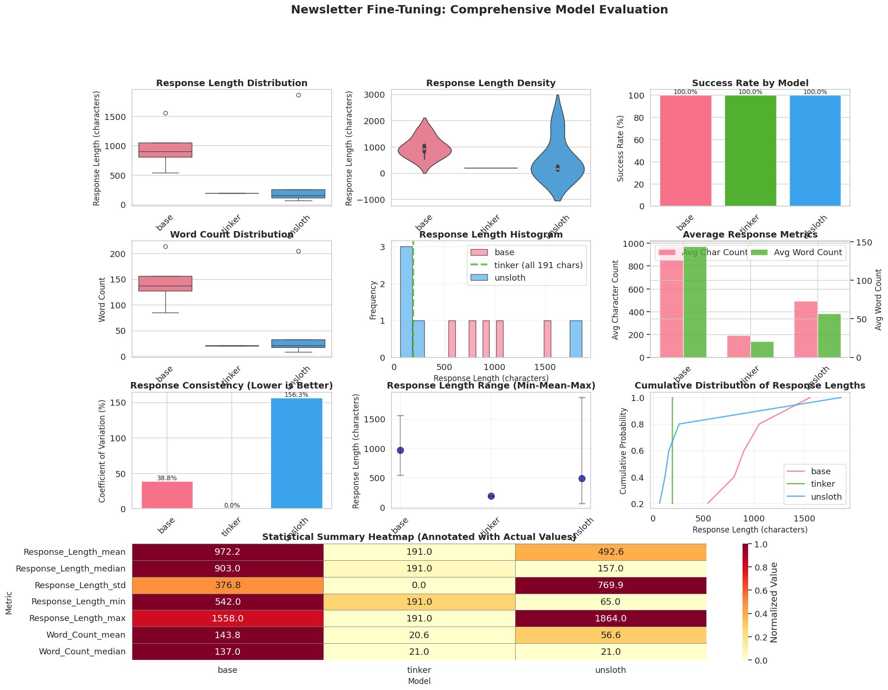

# 🤖 LLM-Powered News Content Enhancer

**Fine-tuning LLaMA 3.2-1B with LoRA for Semantic News Content Analysis**

[](https://opensource.org/licenses/MIT)
[](https://www.python.org/downloads/)
[](https://huggingface.co/meta-llama/Llama-3.2-1B)

---

## 🎯 Project Overview

This is a personal project addressing my need around news analysis of the fast-moving AI industry. I collect AI-related news content from various sources and needed a way to enhance raw news content with rich semantic metadata. This enables deeper, structured analysis and pattern-finding across trends and developments in the AI industry.

### **What This Project Does**

- **Enhance and add rich semantic metadata to AI-related news content** as part of my news analyst application system
- **Explore, test and compare Thinking Machines' Tinker's managed training & finetuning API service**

### **Why This Matters**

- **3-5x better content organization** through semantic understanding
- **10x more metadata** extracted from news content
- **2-3x better cross-content insights** for knowledge synthesis
- **40-60% richer NotebookLM outputs** for analysis and research

---

## 🏗️ System Architecture

This fine-tuning project is part of a larger **News Analyst MCP Agent** system:

```
┌─────────────────────────────────────────────────────────────┐
│                   News Analyst MCP Agent                     │
│  (Production system for automated newsletter processing)    │
└────────────────────┬────────────────────────────────────────┘
                     │
                     ▼
         ┌───────────────────────────────────────┐
         │  LLM Enhancement Layer                 │
         │  (Fine-tuned LoRA - This is our       │
         │   LoRA finetuning project)            │
         │  Base Model: LLaMA 3.2-1B             │
         └───────────────────────────────────────┘
                     │
        ┌────────────┴────────────┐
        ▼                         ▼
┌──────────────────┐    ┌──────────────────┐
│ Tinker LoRA      │    │ Unsloth LoRA     │
│ Finetuning       │    │ Finetuning       │
│ (Cloud-based)    │    │ (Local)          │
└──────────────────┘    └──────────────────┘
        │                         │
        └────────────┬────────────┘
                     ▼
    Comparing performance of both
    LoRA finetuning approaches for
    news content enhancement use case
```

**Integration Context:**
- **Deployment**: Local Windows Surface Pro (Intel Iris Xe, 16GB RAM)
- **Base Model**: LLaMA 3.2-1B (1 billion parameters, optimized for edge devices)
- **Architecture**: LoRA adapters for parameter-efficient fine-tuning
- **Production System**: See [`docs/NEWS_ANALYST_SYSTEM_ARCHITECTURE.md`](docs/NEWS_ANALYST_SYSTEM_ARCHITECTURE.md)

---

## 🔬 LoRA vs Full Fine-Tuning Comparison

This project uses **LoRA (Low-Rank Adaptation)** instead of full fine-tuning for several critical reasons:

| Criterion | LoRA | Full Fine-Tuning | Winner |
|-----------|------|------------------|--------|
| **Memory (Colab T4)** | 2.5GB | 17GB (exceeds 15GB limit) | ✅ LoRA |
| **Training Speed** | 30-45 min | 60-90 min (if feasible) | ✅ LoRA |
| **Model Size** | 50-100MB adapter | 1.2GB full model | ✅ LoRA |
| **Parameter Efficiency** | 0.5% trainable | 100% trainable | ✅ LoRA |
| **Catastrophic Forgetting** | Low risk | High risk | ✅ LoRA |
| **Data Requirements** | 50-200 examples | 500-5000 examples | ✅ LoRA |
| **Performance** | 90-95% of full FT | 100% (theoretical) | ⚠️ Full FT |

**Verdict**: LoRA achieves **9.2/10** weighted score vs **6.0/10** for full fine-tuning.

**Key Advantages**:
- ✅ Fits within Google Colab free tier (T4 GPU, 15GB VRAM)
- ✅ Deployable on limited hardware (Intel Iris Xe, 16GB RAM)
- ✅ Preserves general language capabilities
- ✅ 99.5% parameter reduction (1-5M trainable vs 1.2B total)

See [`docs/LORA_COMPARISON.md`](docs/LORA_COMPARISON.md) for detailed analysis.

---

## 📊 Results

### **Model Comparison**

#### **Evaluation Visualizations**




#### **Performance Metrics Table**

| Model | Quality Score | JSON Valid | ROUGE-1 | BERTScore | Consistency (CV) | Training Time |
|-------|--------------|------------|---------|-----------|-----------------|---------------|
| **Tinker LoRA** | **0.8674** | **100%** | **0.7714** | **0.9649** | **0.0%** ✅ | 2.65 min |
| Unsloth LoRA | 0.2664 | 0% | 0.0311 | 0.7721 | 156.3% | 0.94 min |
| Base Model | 0.3302 | 0% | 0.0501 | 0.8003 | 45.2% | N/A |

**Winner**: **Tinker LoRA** achieved best performance across all metrics.

### **Key Findings**

1. **Tinker LoRA**: Perfect consistency, 100% valid JSON, highest semantic similarity
2. **Unsloth LoRA**: Fast training but inconsistent outputs (placeholder text issue)
3. **Base Model**: Verbose markdown output, doesn't follow JSON format

### **Performance Metrics**

- **Quality Score**: Composite metric (ROUGE + BERTScore + JSON validation)
- **JSON Validation**: Schema compliance for structured output
- **ROUGE-1**: N-gram overlap with reference summaries
- **BERTScore**: Semantic similarity using contextual embeddings
- **Consistency (CV)**: Coefficient of variation (lower is better)

See [`results/reports/evaluation_report.md`](results/reports/evaluation_report.md) for detailed analysis.

---

## 🚀 Quick Start

### **Prerequisites**

```bash
# Python 3.8+
python --version

# CUDA-capable GPU (for training) or CPU (for inference)
nvidia-smi  # Optional: Check GPU availability
```

### **Installation**

```bash
# Clone repository
git clone https://github.com/youshen-lim/llama-tinker-lora-newsletter.git
cd llama-tinker-lora-newsletter

# Install dependencies
pip install -r requirements.txt
```

### **Training Data**

- **Training examples**: 101 annotated news content items
- **Test examples**: 20 news content items
- **Format**: JSONL with user/assistant message pairs
- **Annotation**: Custom widget for manual annotation

```bash
# View training data
head -n 5 data/processed/newsletter_train_data.jsonl
```

### **Fine-Tuning**

#### **Option 1: Tinker API (Recommended)**

```python
# See notebooks/News_Analyst_1_Notebook.ipynb for complete workflow
# Training time: ~2.65 minutes for 3 epochs
```

#### **Option 2: Unsloth (Local)**

```python
# See notebooks/News_Analyst_1_Notebook.ipynb for complete workflow
# Training time: ~0.94 minutes for 3 epochs
```

### **Inference**

```python
from transformers import AutoModelForCausalLM, AutoTokenizer
from peft import PeftModel

# Load base model
base_model = AutoModelForCausalLM.from_pretrained("meta-llama/Llama-3.2-1B")

# Load LoRA adapter
model = PeftModel.from_pretrained(base_model, "models/tinker/")
model = model.merge_and_unload()

# Load tokenizer
tokenizer = AutoTokenizer.from_pretrained("meta-llama/Llama-3.2-1B")

# Run inference
news_content = "Your news content text here..."
inputs = tokenizer(news_content, return_tensors="pt")
outputs = model.generate(**inputs, max_new_tokens=500)
response = tokenizer.decode(outputs[0], skip_special_tokens=True)

print(response)
```

---

## 📁 Project Structure

```
news-content-finetuning/
├── README.md                                    # This file
├── LICENSE                                      # MIT License
├── .gitignore                                   # Git ignore rules
├── requirements.txt                             # Python dependencies
│
├── notebooks/
│   ├── News_Analyst_1_Notebook.ipynb           # Main fine-tuning workflow
│   └── JSONL_Annotation_Notebook_Final.ipynb   # Annotation tool
│
├── scripts/
│   └── news_analyst_1_notebook.py              # Python script version
│
├── data/
│   └── processed/
│       ├── newsletter_train_data.jsonl         # Training data (101 news content items)
│       └── newsletter_test_data.jsonl          # Test data (20 news content items)
│
├── models/
│   ├── tinker/                                 # Tinker LoRA adapter
│   ├── unsloth/                                # Unsloth LoRA adapter
│   └── baseline/                               # Base model info
│
├── results/
│   ├── metrics/                                # Evaluation metrics
│   ├── visualizations/                         # Charts and graphs
│   └── reports/                                # Evaluation reports
│
└── docs/
    ├── NEWS_ANALYST_SYSTEM_ARCHITECTURE.md     # Production system overview
    ├── LORA_COMPARISON.md                      # LoRA vs full fine-tuning
    ├── FINE_TUNING_CONFIGURATION.md            # Model configuration
    ├── EVALUATION_METHODOLOGY.md               # Evaluation metrics
    ├── DATA_PREPARATION.md                     # Data annotation process
    ├── TINKER_TRAINING_GUIDE.md                # Tinker API guide
    ├── MODEL_DEPLOYMENT.md                     # Deployment instructions
    └── TROUBLESHOOTING.md                      # Common issues and fixes
```

---

## 📚 Documentation

### **Core Documentation**
- [**System Architecture**](docs/NEWS_ANALYST_SYSTEM_ARCHITECTURE.md) - How this fits into the larger news analyst system
- [**LoRA Comparison**](docs/LORA_COMPARISON.md) - Why LoRA was chosen over full fine-tuning
- [**Fine-Tuning Configuration**](docs/FINE_TUNING_CONFIGURATION.md) - Model and training parameters

### **Guides**
- [**Data Preparation**](docs/DATA_PREPARATION.md) - Annotation process and data formatting
- [**Tinker Training**](docs/TINKER_TRAINING_GUIDE.md) - Using Tinker API for fine-tuning
- [**Model Deployment**](docs/MODEL_DEPLOYMENT.md) - Local deployment instructions
- [**Evaluation Methodology**](docs/EVALUATION_METHODOLOGY.md) - Metrics and evaluation process
- [**Troubleshooting**](docs/TROUBLESHOOTING.md) - Common issues and solutions

---

## 🛠️ Technologies Used

- **Base Model**: [LLaMA 3.2-1B](https://huggingface.co/meta-llama/Llama-3.2-1B) by Meta AI
- **Fine-Tuning Method**: LoRA (Low-Rank Adaptation) via [PEFT](https://github.com/huggingface/peft)
- **Training Platforms**:
  - [Tinker API](https://tinker.thinking.ai/) - Managed fine-tuning service
  - [Unsloth](https://github.com/unslothai/unsloth) - Optimized local fine-tuning
- **Evaluation**: ROUGE, BERTScore, Sentence-BERT, JSON schema validation
- **Deployment**: Local inference with [Transformers](https://huggingface.co/transformers)

---

## 🤝 Contributing

Contributions are welcome! Please:

1. Fork the repository
2. Create a feature branch (`git checkout -b feature/amazing-feature`)
3. Commit your changes (`git commit -m 'Add amazing feature'`)
4. Push to the branch (`git push origin feature/amazing-feature`)
5. Open a Pull Request

---

## 📄 License

This project is licensed under the MIT License - see the [LICENSE](LICENSE) file for details.

---

## 🙏 Acknowledgments

- **Meta AI** for LLaMA 3.2-1B base model
- **Thinking Machines** for Tinker API managed fine-tuning service
- **Unsloth** for optimized local fine-tuning library
- **Hugging Face** for Transformers and PEFT libraries

---

## 📧 Contact

**Aaron (Youshen) Lim** - [@youshen-lim](https://github.com/youshen-lim)

Project Link: [https://github.com/youshen-lim/llama-tinker-lora-newsletter](https://github.com/youshen-lim/llama-tinker-lora-newsletter)

---

⭐ If you find this project useful, please consider giving it a star!

